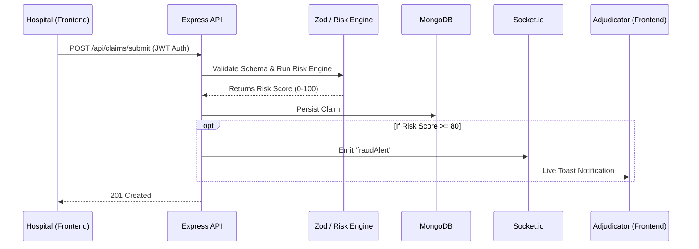

# Triangulate API
> Real-time healthcare claims fraud detection and adjudication workspace.

## Elevator Pitch
Triangulate API is a platform designed for hospital networks and medical adjudicators to intercept, analyze, and adjudicate anomalous medical claims before payout. By employing a deterministic validation engine combined with a WebSocket-driven live triage stream, the system shifts claims review from a slow, post-payment clawback process to a real-time point-of-submission intervention.

---

## Key Features

### Deterministic Fraud Vector Analysis
Incoming claims are synchronously scored against hard-coded clinical and financial rules in `validationEngine.js`. Current logic flags explicit contradictions, such as arithmetic mismatches (itemized sum vs. total billed), gender-incompatible CPT codes (e.g., male pregnancy billing), and contradictory ICD-10/CPT pairings (e.g., Orthopedic diagnoses paired with Obstetrics procedures). 

### Live Triage Stream
Real-time escalation is powered by `Socket.io`. When a submitted claim hits a `riskScore >= 80`, the backend immediately emits a `fraudAlert` payload to the `adjudicators_room`, surfacing the anomaly on the adjudicator's frontend dashboard (`Dashboard.jsx`) without requiring a page refresh.

### Strict Role-Based Access Control (RBAC)
Application boundaries are enforced via `authMiddleware.js`, separating concerns at the route level. Hospitals can exclusively submit and edit their own pending claims. Adjudicators and Superadmins hold exclusive rights to view aggregate data across the network and mutate claim statuses (Approved/Rejected).

### Secure Document Handling
Supporting medical documents are handled via a `multer` and `cloudinary` pipeline, stripping binary blobs from the primary MongoDB document and replacing them with secure, external Cloudinary URLs stored in the `documentUrl` field.

---

## Architecture Overview



**Request Flow**: The application operates as a stateless REST API backed by a stateful WebSocket connection. A hospital submits a claim via HTTP POST. The backend validates the payload structure, calculates a deterministic risk score, and persists the data to MongoDB. If the calculated risk crosses the high-alert threshold (80+), the Express controller grabs the global Socket instance and emits a localized event exclusively to connected adjudicators.

---

## Tech Stack

| Tool | Implementation Role |
| :--- | :--- |
| **React 19 & Vite** | SPA framework and build tooling for the `phantom-frontend`. |
| **TailwindCSS** | Utility-first styling implementation. |
| **Framer Motion** | UI layout animations and list transitions. |
| **Node.js & Express** | REST API routing and middleware orchestration in `phantom-detection-backend`. |
| **MongoDB & Mongoose** | NoSQL data persistence and ORM modeling. |
| **Zod** | Strict schema validation at the HTTP boundary (`validateClaim.js`). |
| **Socket.io** | Persistent duplex connections for real-time risk escalation. |
| **JSON Web Tokens** | Stateless authentication via bearer tokens. |

---

## Robustness & Edge-Case Handling

- **Input Validation**: All inbound claim submissions pass through `validateClaim.js` before controller execution. Zod schemas strictly define types, enforcing requirements like positive integers for costs and required NPI strings. Malformed data is intercepted and returned as a 400 Bad Request with an array of specific field errors.
- **Centralized Error Handling**: `errorHandler.js` acts as a global catch-all middleware, explicitly intercepting Mongoose `CastError` (invalid IDs), `ValidationError` (schema violations), and MongoDB duplicate key conflicts (Code 11000), normalizing them into standard JSON responses.
- **Audit Trails**: Claim status mutations are not overwrites. When an adjudicator approves or rejects a claim, `updateClaimStatus` mandates a corresponding write to the `AuditLog` collection, ensuring historical immutability of adjudicator actions.

---

## Project Structure

```text
/ (Monorepo Root)
├── phantom-detection-backend/
│   ├── config/          # DB connection logic
│   ├── controllers/     # Route execution logic
│   ├── middlewares/     # Auth, Zod validation, Error boundary
│   ├── models/          # Mongoose Schemas (Claim, User, AuditLog)
│   ├── routes/          # Express Routers
│   ├── services/        # Business logic (validationEngine.js)
│   └── server.js        # API Entry point & Socket.io init
│
└── phantom-frontend/
    ├── src/
    │   ├── components/  # Reusable UI (Sidebar)
    │   ├── context/     # Global state (AuthContext)
    │   ├── layouts/     # Route wrappers (Layout.jsx)
    │   ├── pages/       # Route views (Dashboard, SubmitClaim)
    │   └── utils/       # Axios instance config (api.js)
    └── vercel.json      # Client-side routing overrides
```

---

## Setup & Installation

The project is structured as a monorepo containing two separate Node environments. 

### Prerequisites
- Node.js v18+
- MongoDB instance (local or Atlas)

### Backend Setup
```bash
cd phantom-detection-backend
npm install
```
Create a `.env` file in the backend directory:
```env
PORT=5000
MONGO_URI=mongodb+srv://<user>:<password>@cluster...
JWT_SECRET=your_super_secret_string
CLOUDINARY_URL=cloudinary://<key>:<secret>@<cloud_name>
```
Start the backend server:
```bash
npm run dev
```

### Frontend Setup
```bash
cd ../phantom-frontend
npm install
```
Create a `.env` file in the frontend directory:
```env
VITE_API_URL=http://localhost:5000
```
Start the frontend development server:
```bash
npm run dev
```

---

## Known Limitations / Roadmap

- **Deterministic vs. Probabilistic Scoring**: The risk engine (`validationEngine.js`) currently relies on a rigid, hard-coded ruleset (switch/if statements). It does not yet employ probabilistic Machine Learning or AI models to detect zero-day fraud patterns.
- **Storage Constraints**: Document storage relies entirely on external Cloudinary URLs; there is no local fallback or S3 abstraction implemented.
- **Audit Granularity**: The `AuditLog` collection successfully tracks adjudicator status changes (Approved/Rejected), but granular, field-level edit histories (tracking exactly which CPT code a hospital edited) are not yet implemented.

---

## Pitch Cheat Sheet

**The Problem**: Medical claims adjudication relies on slow, post-payment clawbacks instead of real-time point-of-submission interception.

**Who it's for**: Hospital networks seeking billing compliance, and Insurance Adjudicators requiring triage tools for high-risk payouts.

**Standout Technical Decisions**:
1. **Zero-Trust API Boundary**: We utilized Zod for runtime schema validation, guaranteeing that malformed or malicious data structures never reach the database or the scoring engine.
2. **Sub-Second Escalation**: By layering `Socket.io` over a standard REST architecture, we bypassed traditional HTTP polling, enabling high-risk anomalies to physically appear on an adjudicator's screen the millisecond a hospital submits them.
3. **Monorepo Deployment**: Structuring the project as a monorepo allowed for distinct, decoupled environments (Vite for Vercel, Express for Render) while keeping the developer context unified.

**The Hardest Problem Solved**: 
Translating complex, abstract billing anomalies (e.g., Orthopedic ICD-10 codes billed alongside Obstetrics CPT codes) into a deterministic, computationally inexpensive scoring engine that could execute in real-time before the HTTP response is returned to the client.

### Pitch Scripts

**30-Second Pitch**
"Triangulate API is a real-time healthcare claims triage platform. We solve the problem of slow, post-payment fraud clawbacks by intercepting anomalies at the point of submission. Our backend runs a deterministic risk engine against every incoming claim. If it catches a severe clinical or financial mismatch, it bypasses the database queue and uses WebSockets to instantly alert human adjudicators on their dashboard. It shifts fraud detection from reactive to proactive."

**2-Minute Pitch**
"Currently, medical claims adjudication is a slow process where anomalies are often caught only after payouts are made, leading to expensive clawbacks. Triangulate API is a unified workspace designed to intercept these claims in real-time. 

Built on a decoupled React and Node.js architecture, the platform enforces strict role-based access. Hospitals submit claims via our API, where they immediately hit a zero-trust validation boundary powered by Zod. Once the data structure is verified, it passes into our custom deterministic validation engine. This engine specifically hunts for concrete contradictions—like a male patient billed for an obstetrics CPT code, or an itemized procedure list that mathematically contradicts the total billed amount.

The hardest technical challenge was making this escalation instantaneous. Instead of forcing adjudicators to refresh dashboards or poll the database, we layered Socket.io into the Express server. The exact millisecond a claim crosses our high-risk threshold of 80, the backend emits a localized event that surfaces a live alert directly on the adjudicator's screen. We've combined secure, immutable audit logging with sub-second WebSocket alerting to finally shift claims adjudication from a reactive audit to a proactive, real-time intervention."
